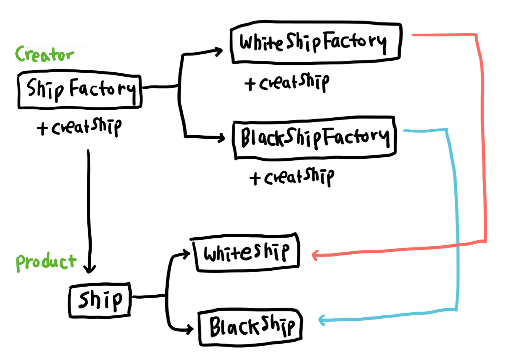

# 팩토리 메소드 패턴 (Factory Method Pattern)
상위 클래스는 인터페이스를 정의하는 역할만 담당하고, 하위 클래스에서 어떤 인스턴스를 생성할지 결정하도록 하는 패턴   
객체의 생성과 동작을 분리하여 서브 클래스에서는 인스턴스를 생성하고 상위 클래스에서는 공통된 동작을 수행한다.   

## 예시

배를 생산하는 `Ship` 클래스가 있고, 해당 클래스에서는 흰 배, 검정 배 등 다양한 종류의 배를 생산할 수 있다고 하자.

```javascript
class Ship {
  constructor(type: string) {
    switch (type) {
      case 'white':
        this.color = 'white';
        this.logo = '🛳';

        break;
      case 'black':
        this.color = 'black';
        this.logo = '⛴';
        break;
    }
  }
}
```

위 클래스처럼 모든 종류의 배를 하나의 `Ship` 클래스에서 생산한다면 새로운 배가 추가될 때마다 생성자의 switch 문에 원하는 case를 추가하면 된다. 코드가 짧을 땐 크게 문제가 없어 보일지 모르겠지만, 생산하는 배의 종류가 점점 많아질수록 constructor 코드는 아래로 쭉 길어짙 테고 코드의 가독성도 떨어질 것이다. 한참이 지나 흰 배의 로고를 바꿔야 하는 일이라도 생긴다면 긴 코드를 방황하다 자칫 엉뚱한 곳을 수정할지도 모른다. 이런 문제점은 객체 지향 원칙 중 개방 폐쇄 원칙(OCP, Open-Closed Principle)에 어긋난다. 새로운 속성이나 기능이 추가될 때 기존 코드를 수정하지 않도록 해야하지만 위 코드는 배가 추가될 때마다 `Ship` 클래스가 계속 수정되기 때문이다.

팩토리 메소드 패턴은 이름 그대로 공장처럼 속성이나 기능이 비슷한 클래스를 만드는 상위의 `ShipFactory` 추상 클래스를 두는 것을 의미한다. `Ship` 클래스가 모든 배를 직접 만드는 대신 `ShipFactory` 클래스는 배를 만드는 추상 메소드만 가지고 있고, 이를 상속하는 서브 클래스애서 배를 만드는 메소드를 구현해 자신의 입맞에 맞게 속성에 맞는 배를 만들면 된다. `WhiteShipFactory`에서는 `WhiteShip`을 생산하고, `BlackShipFactory`에서는 `BlackShip`을 생산하면 되는 것이다.

이렇게 되면 OCP를 따를 뿐 아니라 Creator와 Product의 결합도가 느슨해지는 장점도 갖는다.
기존 `Ship` 클래스에서는 `Ship` 클래스가 Product인 배의 모든 속성을 알고 직접 설정해줘야 했기 때문에 `Ship` 클래스는 배가 갖는 모든 속성과 메소드를 알고 있어야만 했다. 하지만 팩토리 메서드 패턴을 사용하면 Creator인 `ShipFactory`는 단지 배의 인터페이스인 `Ship` 클래스를 리턴해주기 때문에 `Ship` 클래스에서 어떤 속성을 가지고 있든 알 필요가 없기 때문이다.

팩토리 메소드 패턴은 유사한 구조의 Product가 여러개 존재할 경우에 유용하다. 큰 틀은 유사하지만 매개변수나 조건에 따라 세부적인 내용이 다른 클래스가 여러개 존재할 경우 Creator에서 조건에 따라 각기 다른 인스턴스를 리턴하는 방식으로 사용할 수 있다.

## 구조


