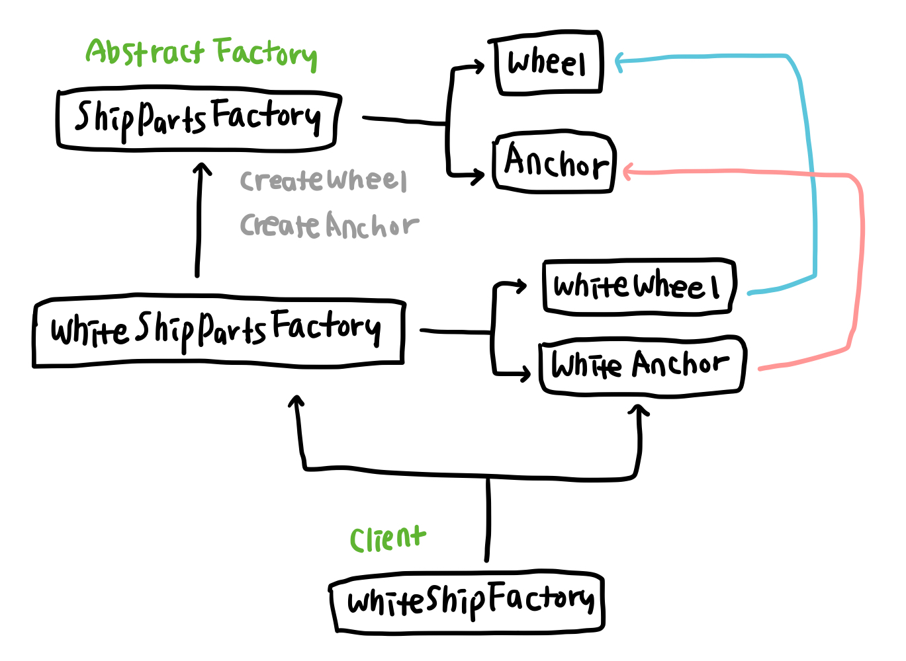

# 추상 팩토리 패턴 (Abstract factory Pattern)
서로 관련이 있는 여러 객체를 하나의 팩토리 클래스로 캡슐화하여 제공하는 패턴   

추상 팩토리 패턴은 서로 관련성이 있는 여러 종류의 인스턴스를 클라이언트에서 각각 호출하는 대신 여러 인스턴스를 하나의 팩토리 클래스에서 생성할 수 있도록 하는 패턴이다. 앞에서 살펴 본 팩토리 메소드 패턴과 추상 팩토리 패턴은 모두 객체 생성 과정을 추상화한 인터페이스를 제공한다. 하지만 팩토리 메소드 패턴은 인스턴스의 생성과 동작을 서브 클래스와 부모 클래스로 분리하는 것이 목적이지만 추상 팩토리 패턴은 여러 관련 있는 인스턴스를 하나의 클래스에서 제공하기 위한 패턴이다. 팩토리 메소드 패턴은 인스턴스를 생성하는 방식을 구조화해 팩토리 클래스를 구현하는 방법에 초점을 두고, 추상 팩토리 패턴은 클라이언트가 인스턴스를 호출하는 방식을 구조화해 팩토리를 사용하는 방법에 초점을 둔다. 

추상 팩토리 패턴을 사용하면 관련 있는 객체들을 캡슐화해 클라이언트가 각 객체들을 직접적으로 의존하지 않고 일관된 방식으로 사용할 수 있다. 관련있는 객체들을 그룹화 해 생성해야 하는 객체가 변경되거나 추가되어도 클라이언트의 코드를 직접 수정하는 대신 팩토리 클래스에서 반환하는 인스턴스만 변경하면 된다.


## 예시   
앞에 봤던 팩토리 메서드 패턴 코드에 적용해 보자. 생산한 배에 닻과 키를 추가하려고 한다.
추상 팩토리 메서드 패턴을 사용하지 않는다면 아래처럼 각 배를 생산하는 팩토리 클래스에서 `WhiteAnchor`와 `WhiteWheel`의 클래스의 인스턴스를 직접 생성해줘야 한다.

```javascript
class WhiteShipFactory extends ShipFactory {
  protected createShip(name: string) {
    const ship = new WhiteShip(name);
    ship.setAnchor(new WhiteAnchor());
    ship.setWheel(new WhiteWheel());

    return ship;
  }
}
```
위 코드에 아래와 같이 추상 팩토리 패턴을 적용할 수 있다.    
1. 관련이 있는 객체를 묶을 팩토리 클래스를 생성한다. 여기서는 닻과 키가 배의 부품이라는 그룹으로 묶일 수 있으므로 `ShipPartsFactory` 클래스를 만든다.
2. `ShipPartsFactory` 에서  닻과 키의 인스턴스를 생성하고 반환하도록 한다.
3. 클라이언트에서는 `ShipPartsFactory` 클래스를 이용해 원하는 닻과 키를 `Ship` 클래스에 적용한다.

## 구조


