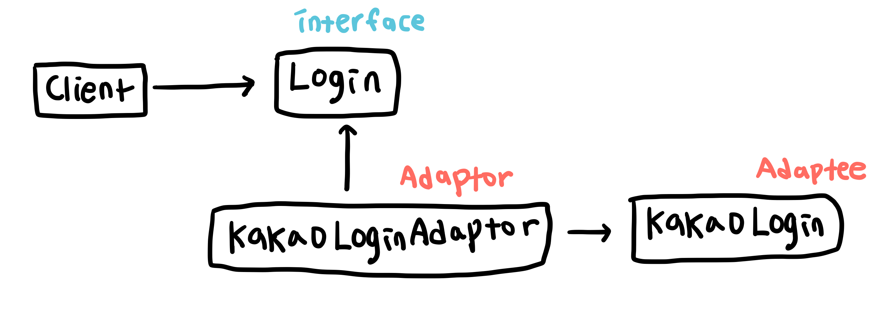

# 어댑터 패턴 (Adaptor Pattern)

인터페이스가 다른 객체를 클라이언트가 사용하는 인터페이스와 통일시키는 패턴  
일상 생활에서 전압이 다른 전기를 어댑터로 연결해주는 것처럼 인터페이스가 다른 객체를 어댑터로 연결하여 클라이언트가 사용할 수 있는 인터페이스로 변경해준다.

외부에서 만든 라이브러리 혹은 다른 곳에서도 사용하고 있는 기존 코드가 현재 클라이언트에서 사용하는 클래스와 인터페이스가 달라 메소드, 프로퍼티 등이 다른 경우, 라이브러리나 기존 코드인 `Adaptee`가 현재 클라이언트에서 사용하는 인터페이스를 따르도록 변경해준다. 기존 코드를 수정할 수 있다면 기존 코드를 타겟 인터페이스 맞게 변경해주면 되지만, 그렇지 못하는 경우 클라이언트가 사용하는 인터페이스를 따르는 `Adaptor` 클래스를 생성하고 `Adaptee`를 해당 인터페이스에 맞게 변경해준다. 클라이언트에서는 `Adaptor` 클래스를 사용하면 된다.

## 예시

사용자에게 사이트에 가입된 아이디를 이용한 로그인 서비스를 제공하는 서비스가 있다. 여기에 아이디를 사용한 로그인 뿐 아니라 카카오 계정을 사용한 로그인 방식을 추가하려고 한다. 이 때 기존 아이디를 사용한 로그인 클래스 `IDLogin` 과 카카오 계정을 사용하는 로그인 클래스 `KakaoLogin (Adaptee)`의 인터페이스가 다르다면 `KakaoLogin` 클래스가 `IDLogin` 클래스의 인터페이스를 따르도록 `KaKaoLoginAdaptor` 클래스를 만들어 준다.

## 구조

