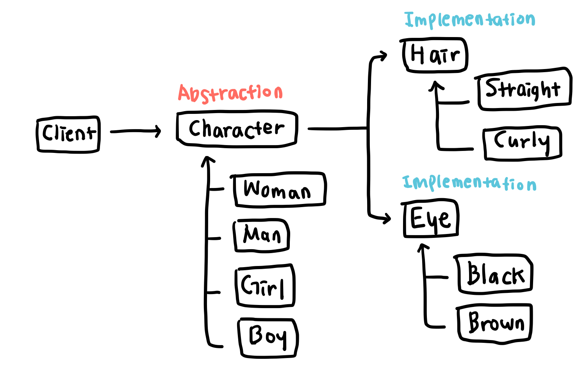

# 브릿지 패턴 (Bridge Pattern)   
추상적인 부분과 구체적인 부분, 혹은 서로 성격이 상이한 것을 클래스로 분리하고 연결해주는 브릿지를 만드는 패턴   

추상적인 부분의 `Abstraction`은 고차원의 추상적인 로직을 담고 있으며 구체적인 부분의 `Implementation`은 구체적인 상태나 정보를 담고 있다. 추상적인 부분과 구체적인 부분은 각각 별도의 계층 구조를 가지고 있어 `Abstraction`을 상속하는 클래스와 `Implementation`을 상속하는 클래스들이 존재한다. 추상적인 부분과 구체적인 부분이 서로에게 영향을 주지 않은 채 독립적으로 변형과 확장이 가능하다.   
`Abstraction`은 `Implementation`을 컴포지션의 형태로 사용하며, 클라이언트는 `Abstraction`을 이용해 간접적으로 `Implementation`을 사용한다.

## 예시   
게임에서 캐릭터를 생성할 때 먼저 외형을 선택한 뒤 외형에 맞는 헤어 스타일이나 눈, 코, 입 등의 모양 등을 선택한다. 여기에 브릿지 패턴을 적용하면 외형은 추상적인 부분의 `Abstraction`, 외형에 얹힐 적용되는 스타일들은 `Implementation`이 된다. 만약 브릿지 패턴을 적용하지 않는다면 m개의 외형과 n개의 스타일을 조합한 클래스들이 m*n개만큼 생성되어야 하지만, 브릿지 패턴을 적용하면 클라이언트에서 원하는 `Abstraction`에 원하는 `Implementation`을 파라미터로 전달해 조합할 수 있다.

## 구조
