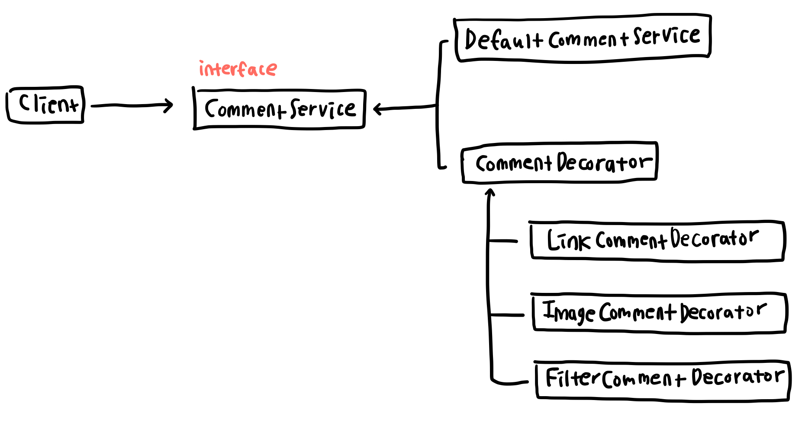

# 데코레이터 패턴 (Decorator Pattern)

기존 클래스에 기능이 추가되어야할 때 기존 코드를 변경하지 않고 부가 기능을 덧붙이는 패턴  
이름 그대로 기존 클래스에 기능을 장식하는(decorate) 패턴이라고 생각하면 쉽다.

## 구현 방법

새로운 기능이 추가될 때 기존의 코드와 동일한 인터페이스를 구현하는 클래스를 추가하며, 새로운 클래스는 기존 클래스의 기능을 위임한다.

1. 기존 클래스의 인터페이스를 따르는 `Decorator` 클래스를 만든다.
2. `Decorator` 클래스는 동일한 인터페이스를 따르는 다른 클래스의 인스턴스를 매개변수로 전달받는다. 각 `Decorator`마다 자신의 기능을 수행한 뒤 매개변수로 전달받은 인스턴스의 기능도 수행하도록 위임하기 위해서이다.
3. 기능이 추가될 때마다 이 `Decorator` 클래스를 상속하는 클래스를 추가한다.
4. 클라이언트는 원하는 기능의 클래스를 동적으로 선택하여 사용할 수 있다.

기존 클래스를 상속한 새로운 클래스를 추가하는 방법으로도 기능을 확장하는 방법도 생각해 볼 수 있다. 하지만 상속을 사용하면 2가지 이상의 기능을 함께 사용하고자 할 때마다 새로운 클래스를 추가해야 한다. 즉 A와 B의 기능을 모두 구현하고 싶은 경우에는 A를 상속하는 B를 만들고 B를 상속하는 새로운 C를 만들어야 한다. 경우의 수에 따라 모든 클래스를 미리 만들어 놓아야 하므로 코드가 복잡해지며 확장에 유연하지 못한 방법이다. 이에 비해 데코레이터 패턴은 하나의 기능이 추가된 클래스를 여러 방법으로 조합함으로써 다양한 기능을 연쇄적으로 수행할 수 있으므로 객체 지향 원칙 중 단일 책임의 원칙과 개방 폐쇄 원칙을 따를 수 있다.

## 예시

사용자가 입력한 댓글을 화면에 노출해주는 클래스를 생각해보자. 처음에는 `DefaultCommentService` 클래스에서 단순 텍스트만 입력받아 그대로 노출하였지만 아래 3가지의 기능을 가진 클래스를 추가하려고 한다.

```javascript
// 본문에 URL이 포함된 경우 URL을 링크로 변환해주는 기능
class LinkCommentDecorator {}

// 본문에 img 태그가 포함된 경우 이미지를 노출시키는 기능
class ImageCommentDecorator {}

// 본문에 비속어가 있는 경우 * 처리 하는 기능
class FilterCommentDercorator {}
```

클라이언트는 원하는 `Decorator` 클래스를 조합하여 아래와 같이 사용할 수 있다.

```javascript
new ImageCommentDecorator(new LinkCommentDecorator(new DefaultCommentService()));
```

## 구조


