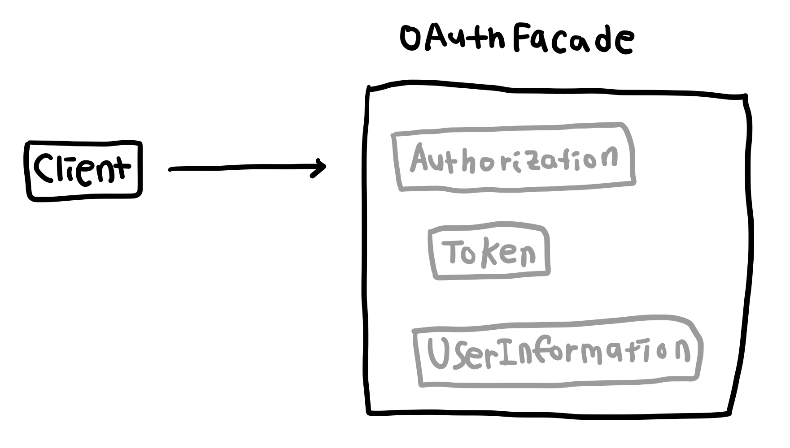

# 퍼사드 패턴 (Facade Pattern)
여러 서브 클래스들을 퍼사드 클래스로 감싸 서브 시스템에 대한 클라이언트의 의존성을 최소화하는 패턴

Facade는 건물의 외관을 뜻하는 말로 클라이언트에게 건물의 외관을 노출시키고, 그 내부에서 일어나는 일은 숨기는 방법이다. 특정한 기능을 수행할 때 여러 클래스들을 참조해야 하는 경우 클라이언트가 직접 그 클래스들의 인스턴스를 생성하고 메소드를 호출하는 대신 `Facade` 클래스 내부에서 모든 프로세스를 진행하고, 클라이언트는 `Facade` 클래스만 의존하게 하는 방식이다. 서브 시스템의 의존성을 한 곳으로 모으고 클라이언트는 외관의 (Facade) 클래스만 의존하면 되니 코드의 유지보수와 재사용이 쉬워진다. 여러 개의 라이브러리나 API 들을 의존해야 하는 경우 적용하면 유용하다.

## 예제
OAuth 인증을 사용하기 위해 클라이언트에서 아래와 같은 단계를 거친다고 가정해 보자.
1. OAuth 서버에 인증 코드를 요청한다. 
2. 서버로부터 인증 코드를 받으면 인증 코드로 토큰을 요청한다.
3. 서버로부터 토큰을 받으면 토큰으로 사용자 정보를 요청한다.

OAuth 인증을 사용하는 곳마다 위 세 단계에 해당하는 코드를 직접 호출한다면 동일한 코드가 중복되고 유지 보수가 어려워진다.
퍼사드 패턴은 위 프로세스를 모두 내부 시스템으로 숨긴 뒤, 퍼사드 클래스에서 제공하는 하나의 메소드만 사용할 수 있도록 한다.

## 구조
