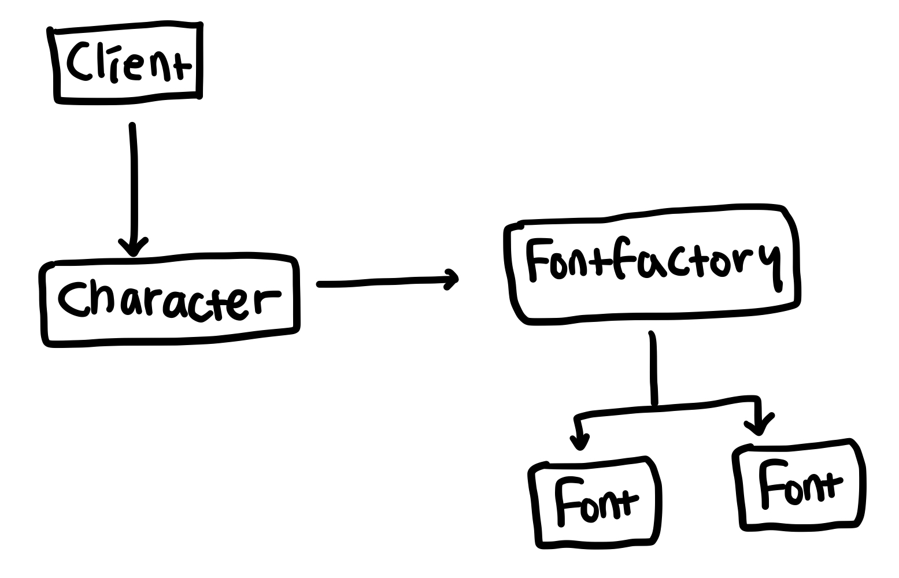

# 플라이웨이트 패턴 (Flyweight Pattern)

인스턴스 생성을 최소화하여 메모리 낭비를 줄이는 패턴

## 구현 방법

1. 객체의 속성 중 자주 변하는 속성과 변하지 않는 속성을 분리하고 변하지 않는 속성을 묶어 하나의 클래스 `Flyweight`로 분리한다.
2. `Flyweight`를 생산하는 `FlyweightFactory` 클래스를 만든다.
3. 클라이언트는 `FlyweightFactory` 클래스를 호출해 필요한 `Flyweight` 인스턴스를 얻는다.
4. 클라이언트가 특정한 속성의 `Flyweight` 인스턴스를 요구할 경우 `FlyweightFactory` 클래스는 동일한 속성을 가진 인스턴스가 캐시되어 있는지 확인한다.
5. 만약 있다면 해당 인스턴스를 반환하고, 없다면 새로운 인스턴스를 생성하고 반환한다.
6. 이 때 인스턴스를 새로 생성한다면 해당 인스턴스를 캐시해 두고 다음에 동일한 요청이 있을 때 캐시된 인스턴스를 반환한다.

## 예시

텍스트 에디터를 만든다고 가정하자. 각 글자마다 `Character` 클래스를 사용하여 크기, 글꼴, 색상을 지정할 수 있다.

```javascript
class Character {
  constructor(value, fontFamily, size, color) {
    this.value = string;
    this.font = new Font(fontFamily, size, color);
  }
}
```

클라이언트는 아래와 같이 각 글자 별로 `Character` 클래스를 호출하여 사용한다.

```javascript
class Client {
  constructor() {
    new Character('안', 'NotoSansKR', 18, '#000');
    new Character('녕', 'NotoSansKR', 18, '#000');
    new Character('하', 'NotoSansKR', 18, '#000');
    new Character('세', 'NotoSansKR', 18, '#000');
    new Character('요', 'NotoSansKR', 18, '#000');
    new Character('!', 'NotoSansKR', 20, '#ff0000');
  }
}
```

각 글자별 속성을 보면 '안녕하세요' 글자는 모두 동일한 글꼴, 크기, 사이즈를 가지고 있다. 5글자 각각 `Character` 인스턴스에서 개별의 `Font` 인스턴스를 생성한하고 있으니 NotoSansKR 폰트 18px #000 속성의 동일한 인스턴스가 5개나 생성되는 것이다.  
`Font` 클래스처럼 자주 변하지 않는 속성을 가진 클래스는 동일한 속성을 가진 인스턴스를 여러개 생성하지 않고, 이미 생성된 인스턴스를 캐시하여 다른 곳에서도 공통으로 사용하는 패턴이 플라이웨이트 패턴이다. 플라이웨이트 패턴을 사용하면 중복되는 인스턴스 생성을 방지해 메모리 낭비를 최소화할 수 있다.  
다만 주의할 점은, 인스턴스의 특정 속성이 예기치 못한 곳에서 수정되는 사이드 이펙트를 방지해야 하는 것이다. '안녕하세요' 글자가 검정색을 사용하고 있는데 '안' 글자에서 `Font` 인스턴스의 color 값을 임의로 노란색으로 변경해버린다면, 동일한 인스턴스를 사용하는 '안녕하세요' 글자 전체의 색이 노란색으로 변경되어 버린다. 따라서 플라이웨이트 패턴을 사용할 경우 외부에서 임의로 값을 수정할 수 없도록 코드를 작성해야 한다.

## 싱글톤 패턴과 비교

인스턴스를 캐시해두고 호출 시마다 동일한 인스턴스를 반환한다는 점에서는 싱글톤 패턴과 비슷해 보일 수도 있다. 단 싱글톤 패턴은 이름 그대로 어플리케이션 전체에서 단 하나의 인스턴스를 생성하지만, 플라이웨이트 패턴은 동일한 속성을 가진 인스턴스는 하나만 생성하는 것이다. 플라이웨이트 패턴은 클라이언트에서 사용하는 속성의 개수만큼 인스턴스가 생성되므로 전체 어플리케이션에서 다른 속성을 가진 여러 개의 인스턴스가 생성될 수 있다.

## 구조


