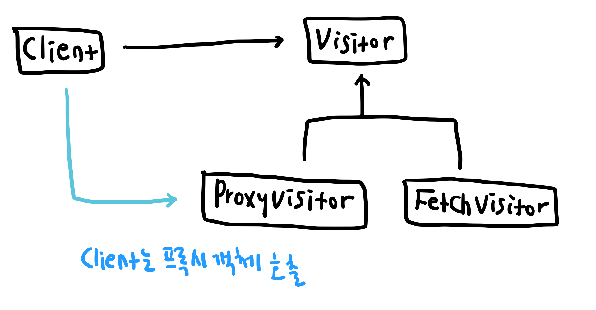

# 프록시 패턴 (Proxy Pattern) 
특정 객체에 대한 접근 이전에 프록시 객체를 거치도록 하는 패턴   

`Proxy`는 사전적으로 `대리인`, `대리의` 란 뜻을 가지고 있다. 프록시 객체도 단어의 뜻과 마찬가지로 원본 객체가 해야 하는 일을 대신하는 객체를 의미하는 것으로 프록시 패턴은 클라이언트가 원본 객체에 접근하기 전에 프록시 객체를 거치는 과정을 추가하는 것이다.    
클라이언트는 원본 객체가 아닌 프록시 객체에 먼저 접근하고 프록시 객체는 필요한 일을 수행한 뒤 클라이언트 대신 원본 객체에 접근한다. 경우에 따라서 프록시가 원본 객체의 인스턴스를 생성하지 않을 수도 있는데, 예를 들면 원본 객체가 네트워크 통신과 같이 큰 비용의 작업을 필요로 하는 경우 프록시 객체에 데이터를 캐시해두고 이를 반환한다면 원본 객체가 불필요하다.
프록시 패턴은 위의 예제처럼 데이터를 캐시하거나, 로그를 남기고, 원본 객체의 생성을 지연하고, 접근을 제한하는 등 다양한 목적으로 사용될 수 있다.

## 구조   
프록시 객체는 원본 객체의 인터페이스를 따른다. 여기에 원본 객체를 참조하는 필드를 갖고 있어 원본 객체의 기능을 대신 구현하는 동시에 경우에 따라 원본 객체를 생성하고 메소드를 호출한다.

## 예제  
API를 호출하여 사이트의 실시간 방문자 수를 가져오는 클래스가 있다고 가정하자. 서버와 통신하는 행위가 비용이 많이 들어 이전의 API 호출 이후 5분 이상이 지났을 때만 API를 다시 호출하려고 한다. 

1. 사용자가 API를 호출한 적이 없을 경우에는 원본 객체에서 API를 호출해 실시간 사용자 수를 받는다.
2. 이 때 `Proxy` 객체에 API를 호출한 시간과 응답으로 받은 실시간 사용자 수를 저장한다.
3. 사용자가 이전 API 호출 후 5분 이내에 실시간 방문자 수를 다시 요청하는 경우에는 `Proxy` 객체에 캐시된 실시간 방문자 수를 리턴해준다.   
4. 사용자가 이전 API 호출 후 5분 이후로 실시간 방문자 수를 다시 요청하는 경우에는 원본 객체에서 API 호출한 뒤 다시 `Proxy`에 시간과 응답값을 저장한다.

## 구조

