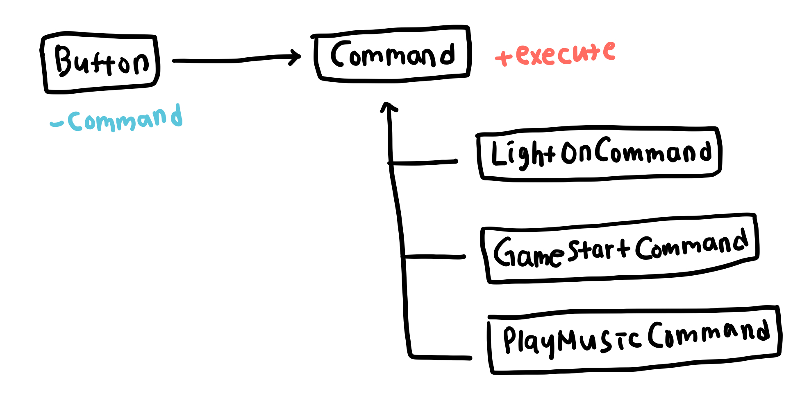

# 커맨드 패턴 (Command Pattern)
기능을 `Commmand` 클래스로 캡슐화하여 호출자(invoker)와 수신자(receiver)를 분리하는 패턴   

특정한 기능을 수행하는 클래스(receiver)를 클라이언트(invoker)에서 호출하고자 하는 경우 invoker가 receiver를 직접 호출하는 대신 `Command` 클래스를 통해 호출한다. `Command` 클래스는 주로 `exeucte` 메소드 하나만 클라이언트에 공개하며 클라이언트는 사용하고자 하는 `Command`를 선택한 뒤 `exeucte` 메소드를 실행하면 된다. 클라이언트는 `Command` 내부에서 어떤 객체 receiver의 역할을 하며 기능이 어떻게 실행되는지 알 필요가 없으며, 내부 구체적인 기능이 수정되더라도 클라이언트 코드의 변경 없이 `Command`만 수정하면 된다. 마찬가지로 receiver를 추가하고자 할 때도 새로운 `Command`를 만들어 추가하면 된다. 또한 receiver 객체를 호출하는 과정에서 로깅, 취소 등의 부가적인 기능을 `Command`에 추가할 수도 있어 다양한 방법으로 활용이 가능하다.

## 전략 패턴과의 비교
원하는 `Command`를 클라이언트가 선택할 수 있다는 점과 전략 패턴의 원하는 전략을 선택한다는 방식이 유사해 보이기도 한다. 전략 패턴은 동일한 목적의 기능을 수행할 때 그 알고리즘이나 방식을 갈아 끼우는 패턴이지만 커맨드 패턴은 각 `Command` 클래스들이 서로 다른 인터페이스의 receiver를 담을 수도 있으며 수행하는 기능 자체가 다를 수도 있다. 전략 패턴이 동일한 기능에 대해 어떻게 알고리즘이 구성되느냐를 기준으로 클래스들을 분리한다면 커맨드 패턴은 무엇을 하느냐에 따라 커맨드 클래스를 분리한다. 무엇보다도 커맨드 패턴의 목적은 invoker와 receiver의 결합도를 낮추고자 하는 데 있어 클라이언트의 요청 자체를 `Command`로 캡슐화해 재사용성을 높이고자 사용하는 패턴이다.

## 예시
하나의 버튼을 다양한 기능으로 사용할 수 있다고 생각해보자. 클라이언트가 어떤 기능을 선택하냐에 따라 전등을 켜고, 게임을 실행하며, 음악을 재생한다. 각 기능들은 `LightOnCommand`, `StartGameCommand`, `PlayMusicCommand`로 분리되어 있으며, 클라이언트가 원하는 클래스를 선택 후 `exeucte` 메소드를 실행하면 해당 기능이 수행된다.

## 구조
