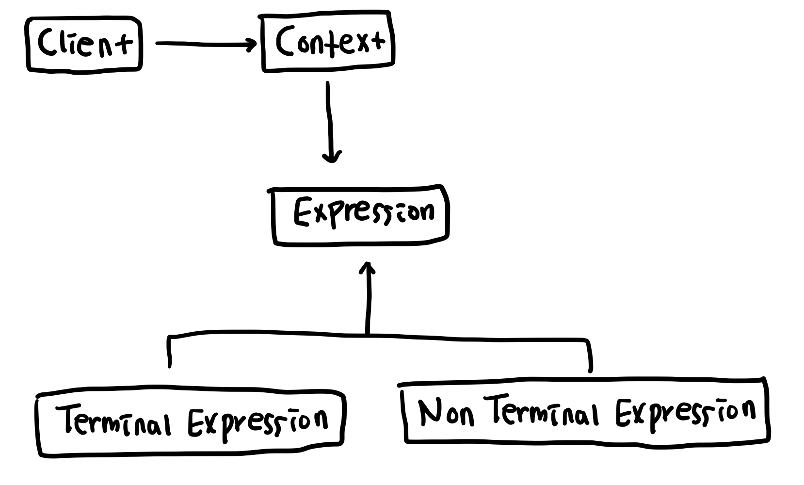

# 인터프리터 패턴 (Interpreter Pattern)
자주 사용하는 구문을 간단한 언어로 정의하고 이를 해석하는 인터프리터를 만드는 패턴   

정규 표현식에서 특정 문자들은 특정한 의미를 가지고 있다. 예를들어 `*` 은 앞의 표현이 0-1개 있을 때, `+` 는 앞의 표현이 1개 이상일 때 일치한다. `RegExp` 클래스에 원하는 표현식을 작성하면 `RegExp` 내부적으로 해당 표현식에 사용된 문자 하나하나를 평가하고, 그 문자의 의미에 맞는 기능을 수행한다.   

인터프리터 패턴도 정규 표현식과 마찬가지로 프로그램에서 자주 사용하는 표현식을 추상 구문 트리 구조로 정의해 활용하는 방식이다.   
인터프리터 패턴은 아래와 같은 구조로 구성되어 있다.

   

* Context : 사용자로부터 표현식을 전달받고 각 글자에 해당하는 `Expression` 클래스를 호출한다.
* Expression : AST의 노드가 되는 `Expression` 클래스의 인터페이스 역할을 한다. 모든 `Expression` 클래스는 `interpret` 메소드를 가지고 평가 결과를 반환한다.
* Terminal Expression : 다른 `Expression` 클래스를 참조하지 않고 클래스 내부에서 해석을 완료해 결과값을 반환한다. 정규표현식에서 일반 문자들은 앞 뒤의 문자들이 무엇이든 상관없이 원본 문자를 반환하므로 `Terminal Expression`에 해당한다.
* Non Terminal Expression : 다른 `Expression` 클래스를 재귀적으로 참조하며 규칙을 해석한다. 정규표현식에서 `*`, `+`등의 특수문자는 앞에 오는 문자가 무엇인지 확인하고 해당 규칙에 부합한지 평가해야 하므로 `Non Terminal Expression`에 해당한다.

## 예제
특정 문자열을 반복과 삭제할 수 있는 표현식을 만든다고 가정해보자. 문자열을 n번 반복하려면 `문자열*n`을, 문자열 n개를 삭제하려면 `문자열-n`과 같이 표현한다. 이 표현식에서 문자열이나 `n`은 해당 값 자체를 클래스 내부에서 평가한 후 반환하므로 `Terminal Expression`이 된다. `*`나 `-`은 좌우 문자열과 `n`의 값을 평가한 `Terminal Expression`에서 반환하는 값을 사용하므로 `Non Terminal Expression` 이 된다.