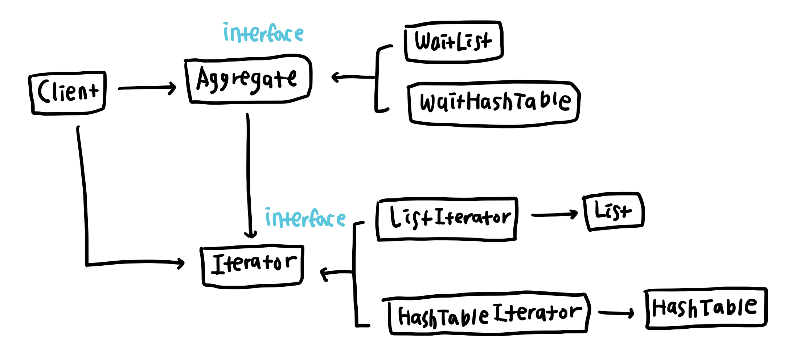

# 이터레이터 패턴 (Iterator Pattern)   
집합 객체의 타입에 따른 구체적인 순회 방법은 숨기고, 클라이언트에는 통일된 순회 방법을 제공하는 방법   

클라이언트에서 리스트, 트리구조, 배열 등의 다양한 집합 객체에 접근해야 할 때, 클라이언트는 해당 집합 객체가 어떠한 자료구조로 만들어졌는지 확인하고 그에 맞는 순회 메소드를 사용해야 한다. 이터레이터 패턴은 이러한 경우에 유용한 패턴으로, 다양한 집합 객체에 대한 접근 방법을 `Iterator` 클래스로 캡슐화하고 클라이언트에게는 하나의 순회 방법을 제공한다.   
`Iterator` 클래스가 집합 객체의 모든 항목에 접근하는 기능을 수행하므로 클라이언트는 각 집학합 객체가 어떻게 이루어져 있는지, 어떤 방식으로 접근해야하는지 알 필요가 없다. 집합 객체에 접근을 위한 코드는 `Iterator` 클래스가 담당하고 클라이언트는 자신의 원래 기능만 구현하면 되므로 단일 책임 원칙도 따를 수 있다.   

## 예시   
대기 예약 시스템을 제공하는 식당 `Client`가 있다. 사용자는 `WaitList` 과 `WaitHashTable`라는 두 플랫폼을 통해 대기 등록을 할 수 있으며, 식당은 빈 좌석이 생길 때 두 플랫폼에 등록된 대기 1번 손님 중 예약 시간이 더 빠른 손님에게 입장 알림을 보낸다. `WaitList` 과 `WaitHashTable` 플랫폼은 이름에서 보듯이 각각 연결 리스트와 해시 테이블의 자료구조로 대기 명단을 가지고 있으며, 연결 리스트는 `getHead` 메소드를, 해시 테이블은 `getFirstItem` 메소드를 이용해 대기 1번 손님의 정보를 가져올 수 있다. 각 플랫폼에서 어떤 자료 구조로 대기 명단을 저장하든 식당은 직접 자료 구조의 메소드를 사용하는 대신 `Iterator` 클래스의 `dequeue` 메소드를 사용해 동일한 방법으로 대기 1번 손님을 가져올 수 있다.

## 구조
클라이언트는 직접 `Iterator` 클래스의 인스턴스를 생성하는 대신 집합 자료 구조를 가지고 있는 클래스 `WaitList`과 `WaitHashTable` 클래스를 통해 `Iterator` 클래스를 참조한다. 이 때 집합 객체를 가지고 있는 클래스를 `Aggregate` 클래스라고 한다.

