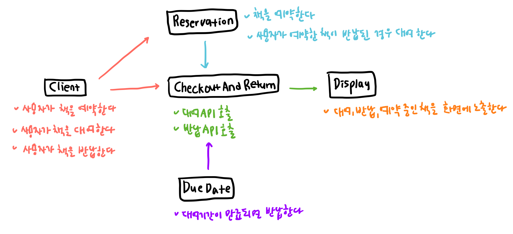
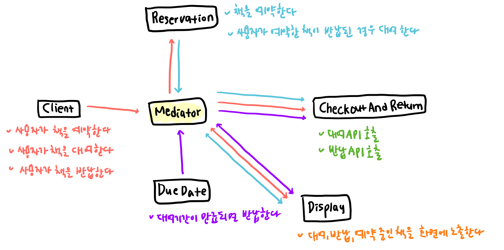

# 중재자 패턴 (Mediator Pattern)
다수의 객체가 서로 상호작용하여 복잡한 관계를 갖는 로직에 중재자를 만들고 중재자를 통해 상호 작용하도록 캡슐화하는 패턴   

다수의 객체가 M : N의 관계를 갖고 직접 상호작용한다면 객체 간 의존성이 높아지고 유지보수가 어려워진다. 중재자 패턴은 다수의 객체가 하나의 중재자와 M : 1 관계를 갖고 중재자를 통해 자신의 행동을 다른 객체에 전달함으로써 객체 간 결합도를 감소시킨다. 각 객체는 중재자 객체에 대한 참조만 가지고 있으며, 새로운 객체가 추가되더라도 중재자 객체만 새로운 참조를 추가하면 되므로 유지보수가 용이하고 코드의 재사용과 확장성이 증가한다.

## 예시
전자책 대여 시스템이 있다. 시스템은 아래와 같이 구성되어 있다.

1. `Client` 클래스 : 사용자로부터 입력을 받는 클래스. 사용자는 버튼을 클릭해 책을 대여, 예약, 반납할 수 있다.
2. `CheckoutAndReturn` 클래스 : 책 대여/반납을 실행하는 클래스. 대여/반납 API를 호출한다.
3. `Reservation` 클래스 : 책 예약을 실행하는 클래스. 사용자가 대여하고자 하는 책을 다른 사용자가 대여하고 있는 경우 예약을 할 수 있다. 예약 API를 호출하며, 다른 사람이 반납하는 책을 자동으로 대여한다.
4. `DueDate` 클래스 : 대여 기간을 관리하는 클래스. 대여 기간이 만료된 책은 자동으로 반납처리 한다.
5. `Display` 클래스 : 대여 / 반납 / 예약 중인 책을 화면에 노출하는 클래스.

    
  
이 시스템에 중재자 패턴을 적용하면 모든 클래스가 `Mediator`를 통해 상호작용하므로 클래스 간 결합도를 낮출 수 있다.

 

