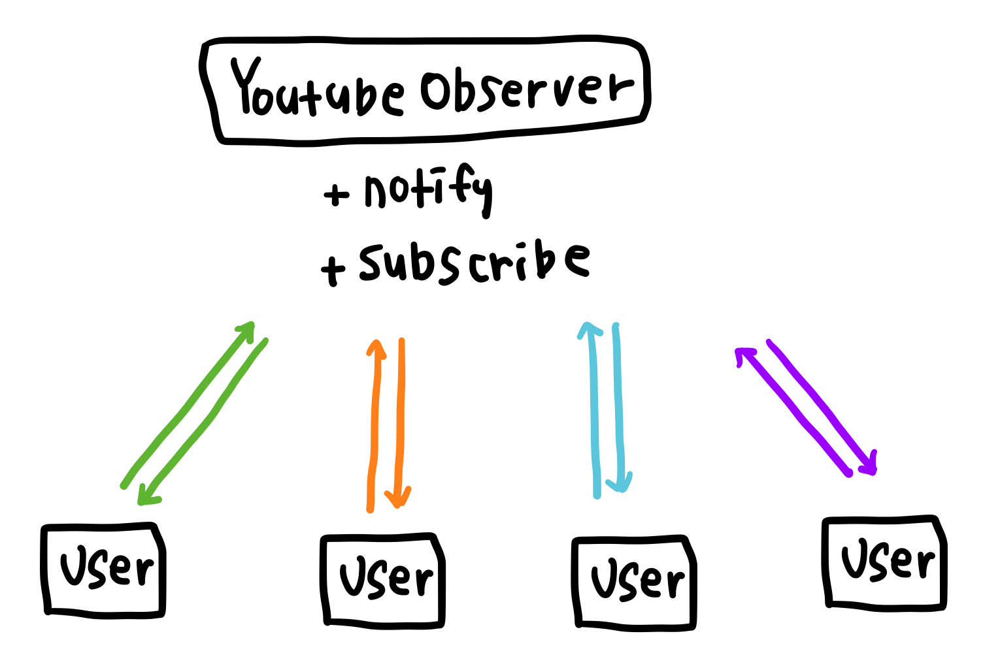

# 옵저버 패턴 (Observer Pattern)
특정 객체의 상태 변화를 관찰하는 객체들(Observer)을 등록하고, 해당 객체의 상태가 변경되었을 때 관찰하는 객체들에게 알림을 보내는 패턴   

쉽게 말해 우리가 유튜브에서 다른 사용자를 구독하고 알림을 받는 시스템이 옵저버 패턴의 일종이라고 할 수 있다.  `Observer` 클래스는 알림을 받을 클래스 `Subscriber`의 리스트를 가지고 있으며, `Observer` 클래스에서 특정한 이벤트가 발생하였을 떄 `Subscriber`들을 순회하며 알림을 보낸다. Javascript의 이벤트 리스너도 일종의 옵저버 패턴인데, 특정한 이벤트를 구독하는 핸들러를 등록하고, 해당 이벤트가 발생하였을 때 등록한 핸들러들을 순회하며 실행하기 때문이다. 

옵저버 패턴을 사용하면 상태를 변경하는 객체(`Publisher`)와 변경을 감지하는 객체(`Subscriber`)를 `Observer`클래스를 통해 느슨하게 연결할 수 있다. `Subscriber`들이 직접 `Publisher`의 상태를 주기적으로 호출하는 대신 `Publisher`에서 이벤트가 발생할 때에만 알림을 전달받을 수 있으며, `Subscriber`가 추가되거나 삭제되더라도 기존 클래스를 수정할 필요가 없다.

## 중재자 패턴과 차이
다수의 객체가 `Mediator` 혹은 `Observer` 객체를 통해 서로 상호작용하는 점에서 중재자 패턴과 옵저버 패턴이 유사해보이기도 한다. 두 패턴의 가장 큰 차이점은 중재자 패턴은 M : N의 상호작용이, 옵저버 패턴은 1 : N의 상호작용이 발생하는 점이다. 중재자 패턴은 앞의 예시와 같이 `Client` 객체에서 [대여] 버튼을 클릭할 경우 중재자의 `checkoutBook` 메소드를 호출하고, `CheckAndReturn` 객체는 다시 중재자의 `display` 메소드를 호출하는 등 다수의 `Colleague`들이 서로의 메소드를 호출하며 쌍방향으로 상호작용이 발생한다. 그에 비해 옵저버 패턴은 `Publisher`에서 이벤트가 발생할 경우 `Subscriber`는 해당 이벤트를 수신하는 역할만 할 뿐 자신의 이벤트를 `Publisher`에게 전달하지 않으므로 단방향의 `notify`만 실행되는 구조이다.

## 예시
유튜브 구독 시스템을 구현해보자. 각 유튜버는 자신의 구독자 리스트를 가지고 있으며, 새로운 동영상을 올리면 자신의 구독자들에게 알림이 간다. 유튜브 시스템에서는 `Publisher`와 `Subscriber`가 구분된 구조가 아닌 모든 유튜버가 이벤트를 발생시키는 `Publisher`이면서 다른 유튜버를 구독하는 `Subscriber`가 될 수 있다.

## 구조
