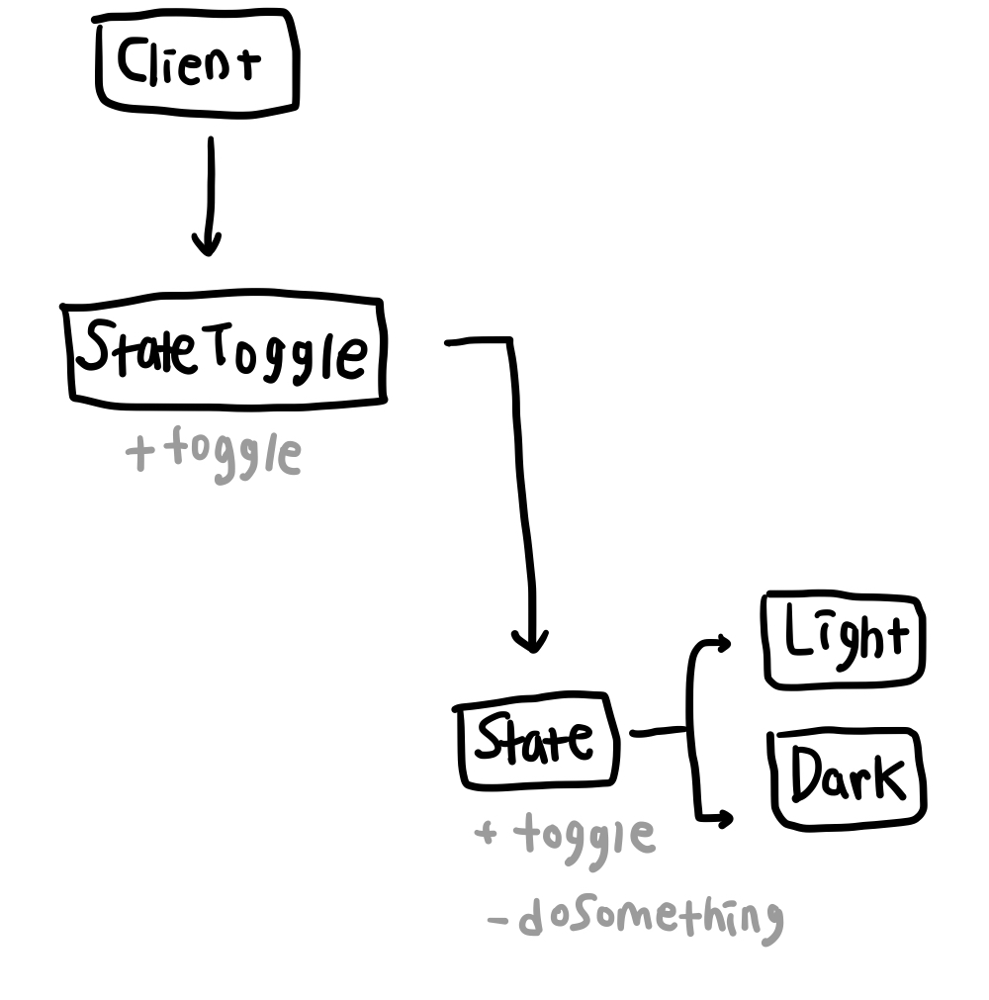

# 상태 패턴 (State Pattern)
특정 객체가 여러 상태 값을 가지고 있고 상태 값에 따라 동작이 달라질 경우 상태에 따른 동작을 클래스로 분리하는 패턴    
특정 상태마다 할 일들을 클래스로 만들어주고 객체의 상태가 변경될 때 각 상태의 인스턴스를 생성해주는 방식이다.

## 전략 패턴과의 비교
전략 패턴과 비슷해보일 수도 있지만 전략 패턴은 하나의 목적 아래에 특정한 기능을 수행하기 위한 방식을 변경해줄 때 사용하며 (ex, 검색이라는 목적 안에서 전체 검색, 제목 검색, 이미지 검색 등의 검색 수행 방식을 변경해준다.) 상태 패턴은 상태에 따른 행위를 구분하고 모듈화하기 위해서 사용한다. 또한 상태 패턴은 상태 클래스의 메소드가 실행될 때 각 상태에 해당하는 기능을 수행하면서 객체의 상태 또한 변경하는 기능을 담을 수도 있다.

다른 디자인 패턴과 마찬가지로 각 상태는 자신의 상태에만 해당하는 기능을 하므로 단일 책임 원칙(SRP)을 따를 수 있으며, 상태가 추가될 때 기존의 코드를 수정하는 대신 새로 하나의 상태를 추가해주므로 개방 폐쇄 원칙(OCP)에도 부합하게 된다.

## 예시   
일상 생활에서 가장 간단한 예시를 생각해보면 TV 리모콘을 생각해볼 수 있다. TV는 [ON] [OFF] 두 상태를 가지고 있으며 리모콘의 전원 버튼을 누름으로써 상태가 변경된다. 또한 [ON] 상태일 때 리모콘의 버튼들을 누르면 동작이 수행되지만 [OFF] 버튼일 때는 어떤 버튼을 누르더라도 동작이 실행되지 않는다.    

개발적인 부분으로 살펴보면 웹 사이트에 라이트/다크모드를 적용할 때 상태 패턴을 사용할 수 있다. 상태는 [Light] [Dark] 두가지가 있으며, 모드를 변경하는 토글 버튼을 클릭하면 상태를 변경할 수 있다. 이 때 사이트에 [Light] 모드가 적용된 상태에서 토글 버튼을 클릭하면 [Light] 클래스 내부에서 객체의 상태를 [Dark]로 변경하며, 반대로 [Dark] 모드가 적용된 상태에서 토글 버튼을 클릭하면 [Dark] 클래스 내부에서 객체의 상태를 [Light]로 변경한다.

## 구조   
