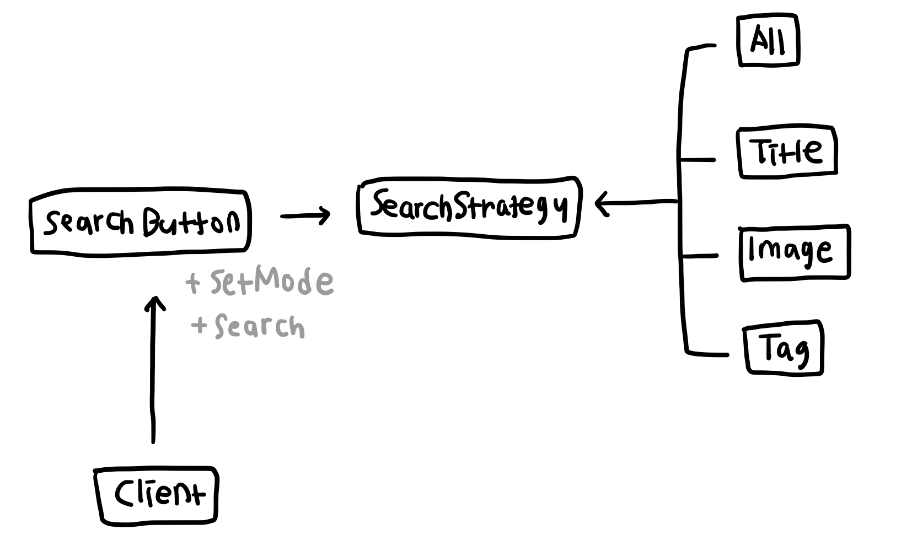

# 전략 패턴 (Strategy Pattern)
어떠한 작업을 수행하는 알고리즘이 여러가지일 때 클라이언트에서 원하는 알고리즘을 선택하여 사용하도록 하는 패턴

이름 그대로 클라이언트에서 원하는 전략을 선택한다고 생각하면 쉽다. 동일한 기능에 대해 구체적인 수행 방법이 다른 여러 종류의 알고리즘이 있을 때 각 방법을 클래스로 캡슐화 한 뒤 클라이언트에서 원하는 알고리즘을 선택해 사용하도록 한다. 클라이언트는 추상화된 인터페이스를 참조해 새로운 전략이 추가되더라도 기존 코드를 변경하지 않는다.   
전략 패턴은 원하는 전략을 파라미터로 전달하는 위임의 방식을 사용하며, 런타임에 동적으로 전략 선택이 가능하다.

## 예시
게시판을 검색할 때 사용하는 방법이 [전체 검색], [제목 검색], [내용 검색], [태그 검색] 4가지가 있다고 가정해보자. 각 검색 모드들이 각각의 전략이 되며 클라이언트가 각 모드로 전환하는 버튼을 클릭하면 해당 모드로 변경이 된다.

## 구조
