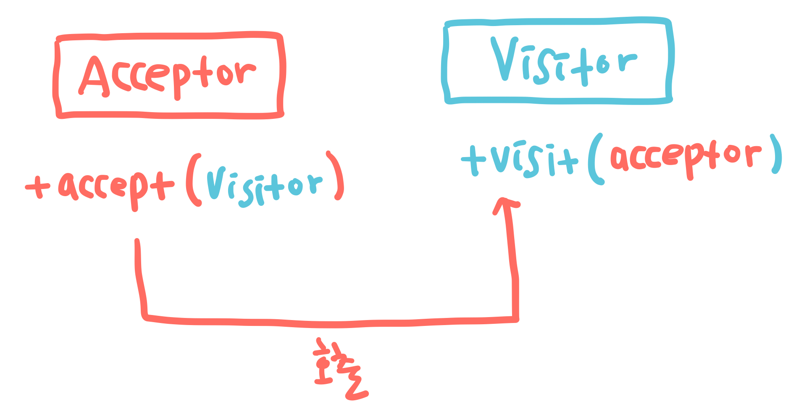

# 방문자 패턴 (Visitor Pattern)

여러 데이터 구조가 존재하고 구조에 따라 데이터를 처리하는 방식이 달라질 때, 데이터 구조와 처리 알고리즘을 분리하는 패턴

## 구현 방법

데이터 구조를 담당하는 클래스와 알고리즘을 구현하는 클래스를 각기 생성하고 두 클래스의 메소드에 서로의 인스턴스를 전달하는 방식으로 구현된다.

### 방문자 클래스 (Visitor Class)

알고리즘의 처리를 담당하는 클래스.  
방문자 클래스는 각 데이터 구조를 방문하는 메서드(`visit`)를 가지고 있으며, `visit` 메소드는 데이터 구조 클래스의 인스턴스를 파라미터로 전달받는다. 어떠한 데이터 구조를 파라미터로 전달 받았냐에 따라 각기 다른 알고리즘이 구현되도록 오버라이딩 방식을 사용한다.

### 데이터 구조 클래스 (Acceptor Class)

데이터 구조를 담당하는 클래스.  
데이터 구조를 담당하는 클래스는 방문자를 받아들이는 메소드(`accept`)를 가지고 있으며, `accept` 메소드는 방문자 클래스의 인스턴스를 파라미터로 전달받는다. `accpet` 메소드는 파라미터로 전달받은 방문자 클래스의 `visit` 메소드에 자기 자신울 파라미터로 전달해 호출한다.

`Acceptor` 클래스의 `accept` 메소드에 `Visitor` 클래스의 인스턴스를 전달하고 (`dispatch`), `Visitor` 클래스의 `visit` 메소드에 `Acceptor` 클래스의 인스턴스를 전달하는 (`dispatch`) 더블 디스패치 방식을 활용할 수 있다.

   
## 예시

HTML 테이블로 표현된 데이터를 json 혹은 xml으로 파싱하는 기능을 구현한다고 가정하자. HTML 테이블 데이터는 `Acceptor` 클래스에서, 파싱을 담당하는 알고리즘은 `Visitor` 클래스에서 구현된다. HTML 테이블 데이터는 `TableData` 클래스를 상속해 테이블 종류에 따라 각기 다른 자식 클래스로 구현되며, 파싱 또한 파싱 결과물에 따라 `Parser` 클래스를 상속한 `JSONParser`, `XMLParser` 클래스로 구분된다. 클라이언트는 `TableData` 인스턴스를 생성한 뒤 원하는 방식의 `Parser` 인스턴스를 `TableData` 인스턴스의 `accept` 메소드에 전달한다.  
침고로, 자바스크립트는 언어 자체에서 오버라이딩 기능을 지원하지 않는다. 따라서 `TableData` 타입에 따라 별개의 메소드를 생성하고 `visit` 메소드에 전달되는 `TableData` 인스턴스의 타입을 `switch` 문으로 분기해 각기 다른 메소드를 실행하는 방식으로 구현한다.

## 장∙단점

데이터 구조에 따라 다양한 처리 방식이 추가되는 경우 기존의 코드를 수정하지 않고 새로운 `Visitor` 클래스를 추가할 수 있다. 그러나 `Acceptor` 클래스가 추가되거나 변경되는 경우 모든 `Visitor` 클래스에서 해당 `Acceptor` 클래스 처리에 대한 코드를 변경해야 하므로 오히려 수정사항이 증가할 수 있다.
